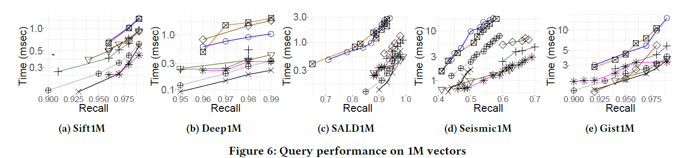

# ELPIS: Revolutionary Graph Structure Technology for Efficient Similarity Search in Large-Scale Data

## 1. Introduction

In modern data science, high-dimensional datasets are becoming increasingly common, covering fields such as agriculture, biology, finance, and smart cities. These applications require extracting valuable information from datasets, and similarity search is a crucial component of these tasks. The goal of similarity search is to find data points in the dataset that are most similar to the query data.

## 2. Background

Existing similarity search techniques can be categorized into three types:

1. **Tree Structures**: Data is divided into multiple nested subspaces for searching.
2. **Hash Structures**: Data is mapped to different buckets using hash tables.
3. **Graph Structures**: Proximity graphs are built, representing data points as vertices connected by edges linking similar points.

Each method has its pros and cons, but graph-based methods perform best in non-guaranteed approximate searches. However, building graph structures on large datasets is very time-consuming and memory-intensive.

### 2.3 Graph-Based Similarity Search

Graph-based methods are currently the most popular non-guaranteed approximate similarity search techniques. These methods typically build a proximity graph structure \(𝐺(V, E)\), where \(V\) is the set of vertices, each representing a data point, and \(E\) is the set of edges connecting similar vertices. When querying \(𝑉𝑄 \in R^𝑑\), the search starts from initial entry points or seeds, using a best-first search greedy algorithm to visit neighboring vertices, returning \(𝑘\) approximate neighbors when no better candidates are found.

#### 2.3.1 Basic Proximity Graphs

1. **Delaunay Graph (DG)**: Guarantees finding the nearest neighbors but is impractical for high-dimensional data due to almost full connectivity.
2. **Gabriel Graph (GG)**: Ensures edges exist only if no other vertex is inside the circle defined by the edge's endpoints.
3. **Relative Neighbor Graph (RNG)**: Retains edges between relatively close vertices.
4. **Minimum Spanning Tree (MST)**: A connected acyclic graph with the minimal sum of edge weights.
5. **k-Nearest Neighbor Graph (k-NNG)**: Each vertex is connected to its \(k\) nearest neighbors.

#### 2.3.2 Basic Search Algorithms

Graph-based similarity search methods typically use beam search, a variant of best-first search, which retains only \(L\) promising candidates during the search process. The \(L\) parameter, or beam width, adjusts the efficiency/accuracy trade-off.

#### 2.3.3 Advanced Methods

The research community has been improving the scalability of graph-based approximate \(k\)-NN search methods. Modern methods are an order of magnitude faster than earlier ones in indexing and query answering. KGRAPH and NNdescent reduce construction costs by refining random initial graphs. HNSW uses a layered structure to build NSW graphs, refined through RNG processes to reduce vertex out-degree.

## 3. ELPIS Method

### 3.1 Method Overview

ELPIS proposes a new graph-based indexing method, combining the advantages of tree and graph structures to achieve efficient indexing and approximate search.

### 3.2 Index Construction

1. **Data Partitioning**: The dataset is first divided into multiple clusters using the Hercules technique.
2. **Graph Structure Construction**: A graph structure is built in parallel on each cluster, using the EAPCA clustering method to store similar high-dimensional vectors in the same leaf node.

### 3.3 Query Answering

1. **Initial Search**: The Hercules tree is traversed to find initial nearest neighbors, selecting candidate clusters.
2. **Parallel Search**: The selected candidate clusters' graph structures are searched in parallel, returning the final \(k\) nearest neighbors.

## 4. Experiments and Results

### 4.1 Index Construction Performance

- **Time**: ELPIS's index construction time is 2-5 times faster than competitors.
- **Memory**: Memory usage is 40% less than competitors.

### 4.2 Query Answering Performance

- **Efficiency**: Query time is 1-2 times faster than the most advanced methods.
- **Accuracy**: In most cases, ELPIS achieves a high recall rate of 0.99.

The following figure shows the query performance of ELPIS and other methods across multiple datasets:

These graphs demonstrate that ELPIS significantly reduces query time while maintaining a high recall rate, outperforming other methods in similarity search efficiency and effectiveness.

The following figure compares the query performance of ELPIS, HERCULES, and QALSH under guaranteed conditions:

****

This graph shows that on Sift and Deep datasets, ELPIS significantly reduces query time while maintaining a high recall rate, outperforming HERCULES and QALSH, demonstrating its efficiency and superiority in similarity search.

## 5. Conclusion

ELPIS proposes an innovative similarity search method that combines the advantages of tree and graph structures to achieve efficient and accurate similarity search. Experimental results show that ELPIS significantly outperforms existing methods in index construction and query answering, providing strong technical support for large-scale data science applications.

## 6. Personal View

The innovation of ELPIS lies in combining graph embedding techniques with tree structure techniques, achieving efficient similarity search, which is of great significance for handling large-scale high-dimensional datasets. Future research can further optimize the index construction algorithm of ELPIS and explore its application in distributed systems to enhance its performance on larger-scale datasets.

paper link: https://dl.acm.org/doi/10.14778/3583140.3583166