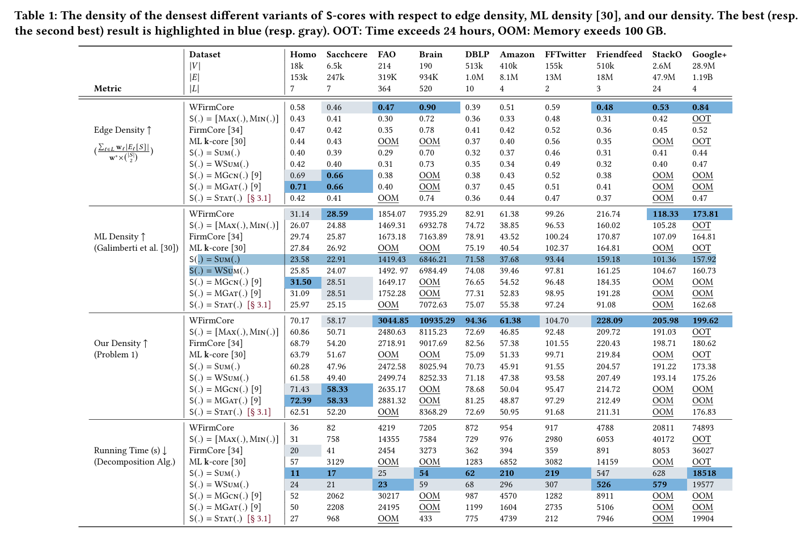

# New Algorithm for Dense Subgraphs in Multilayer Networks: S-core Methodology

## Research Background and Significance

In the study of complex systems, Multilayer Networks (ML) have become an important tool for modeling multidimensional interactions. This model has wide applications in fields such as social networks, biological systems, and financial markets. For example, in social network analysis, interactions between individuals may involve multiple dimensions such as social, professional, and interests. The concept of multilayer networks provides a more comprehensive framework to capture these complex relational structures.

## Research Questions and Challenges

Existing research faces the following key challenges when extending the concept of core structures to multilayer networks:

1. **Overly strict constraints**: Forcing nodes to meet degree constraints in predefined subset layers may lead to the neglect of some important dense structures.
2. **High computational complexity**: Existing algorithms often require exponential time complexity, making them difficult to apply to large-scale real-world networks.
3. **Difficulty in integrating interlayer information**: Different types of relationships may have varying importance in practical applications, and effectively integrating this information remains an open problem.

## Innovative Method: S-core

To address the above issues, this study proposes the S-core method, a novel unified framework for dense structure analysis in multilayer networks. The core idea of S-core is to introduce an abstraction function S(.), which maps each node's multidimensional vector to a lower-dimensional space, thereby effectively reducing computational complexity and avoiding overly strict constraints.

Specifically, given a d-dimensional threshold vector k, a (k, S)-core is defined as a maximal subgraph where the summary degree of each node u in the subgraph is at least k. This definition provides greater flexibility, accommodating different density requirements across layers while ensuring the algorithm's efficiency.

## Method Evaluation and Application Value

The performance of different S-core variants on various datasets is as follows:

The main advantages of the S-core method are:

1. **Unification**: It can unify and extend various existing dense subgraph models.
2. **Computational efficiency**: The introduction of the summary function significantly reduces computational complexity.
3. **Model flexibility**: It can more accurately capture interaction patterns in multilayer networks.

The S-core method excels in identifying the densest subgraphs and modeling user engagement, offering high computational efficiency and the ability to more precisely reflect the structural characteristics of complex networks.

## Comparative Analysis of Dense Subgraph Algorithms

### 1. Traditional Single-Layer Network Dense Subgraph Algorithms

#### 1.1 k-core Decomposition

- **Definition**: A k-core is a maximal subgraph in which each vertex has a degree of at least k.
- **Advantages**: High computational efficiency with time complexity O(m+n), where m is the number of edges and n is the number of nodes. It reveals the hierarchical structure of the network.
- **Disadvantages**: Considers only the degree, possibly overlooking other important structural features.

#### 1.2 k-truss Decomposition

- **Definition**: A k-truss is a maximal subgraph in which each edge participates in at least k-2 triangles.
- **Advantages**: Better captures local dense structures than k-core. It can discover higher-order network structures.
- **Disadvantages**: Higher computational complexity, typically O(m^1.5).

#### 1.3 Maximum Clique Problem

- **Definition**: Finding the largest complete subgraph in the network.
- **Advantages**: Provides the strictest definition of a dense subgraph.
- **Disadvantages**: NP-hard problem with extremely high computational cost in large-scale networks. Sensitive to noise, making it unsuitable for real-world sparse networks.

### 2. Multilayer Network Dense Subgraph Algorithms

#### 2.1 Vector Threshold Method

- **Definition**: Extends the k-core concept to multilayer networks, requiring each node to meet specific degree thresholds in each layer.
- **Advantages**: Intuitively extends the single-layer network concept.
- **Disadvantages**: High computational complexity, typically requiring exponential time. Overly strict constraints may miss some important dense structures.

#### 2.2 Multilayer k-core Decomposition

- **Definition**: Finds maximal subgraphs in multilayer networks that meet multidimensional constraints.
- **Advantages**: Can capture complex structures in multilayer networks.
- **Disadvantages**: High algorithmic complexity, making it difficult to apply to large-scale networks. Inflexible handling of the importance of different layers.

#### 2.3 S-core Method (Proposed in this study)

- **Definition**: Introduces an abstraction function S(.) to map nodes' multidimensional vectors to lower-dimensional space and defines dense subgraphs based on this.
- **Advantages**: High computational efficiency, avoiding exponential time complexity. Provides a more flexible definition of dense structures, accommodating the importance of different layers. Unifies various existing dense subgraph models.
- **Disadvantages**: The choice of the summary function may affect the quality of the results. Specific applications may require parameter adjustments.

## Research Prospects

The proposal of the S-core method opens up new research directions for multilayer network analysis. Future work can focus on the following aspects:

1. **Optimization of the abstraction function**: Explore more types of abstraction functions to meet the needs of different application scenarios.
2. **Dynamic network analysis**: Extend S-core to the analysis of temporal multilayer networks.
3. **Large-scale parallel algorithms**: Develop distributed algorithms based on S-core to address the challenges of ultra-large-scale networks.
4. **Interdisciplinary applications**: Explore the potential applications of S-core in fields such as social sciences and bioinformatics.

In summary, the S-core method provides a powerful and flexible tool for complex network analysis, promising significant impacts across multiple fields. This study not only advances the theory of multilayer networks but also provides new analytical perspectives and methodological support for practical applications.

	[Paper link](https://arxiv.org/abs/2406.13734)